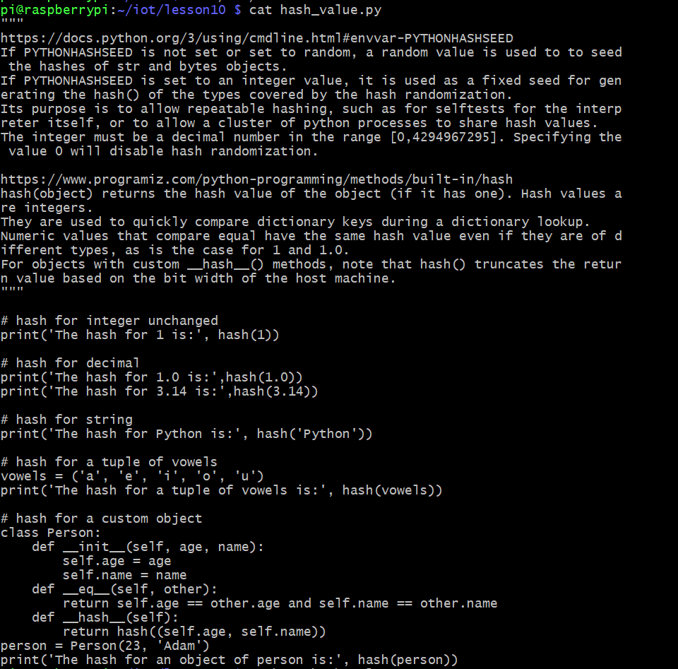
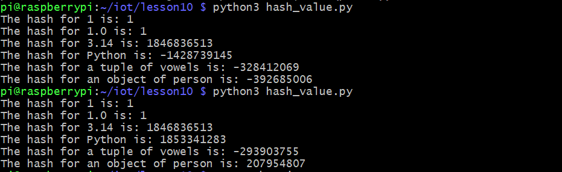
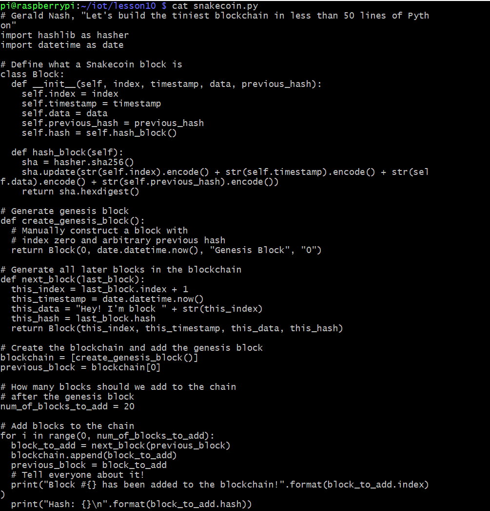
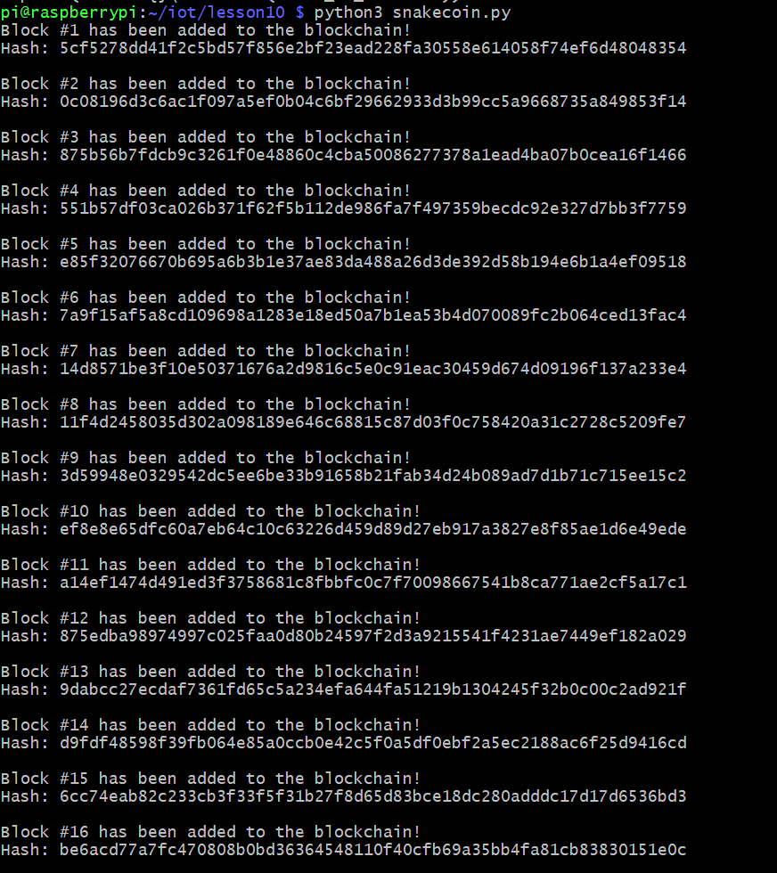
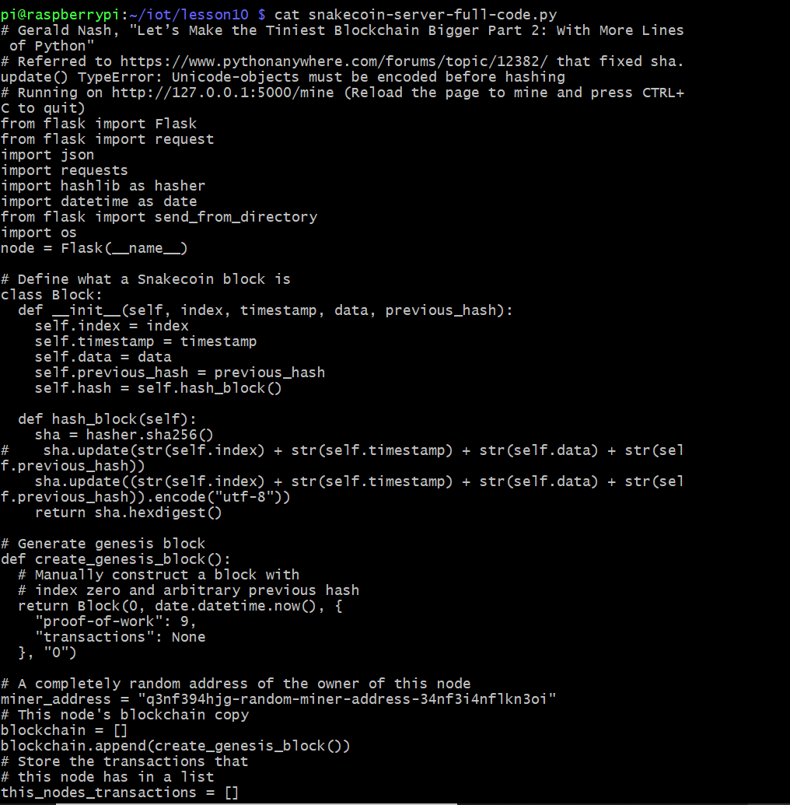
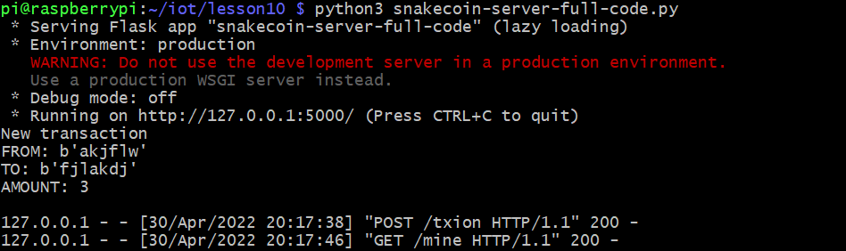
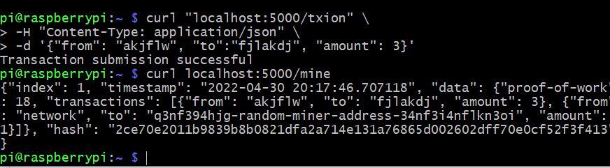
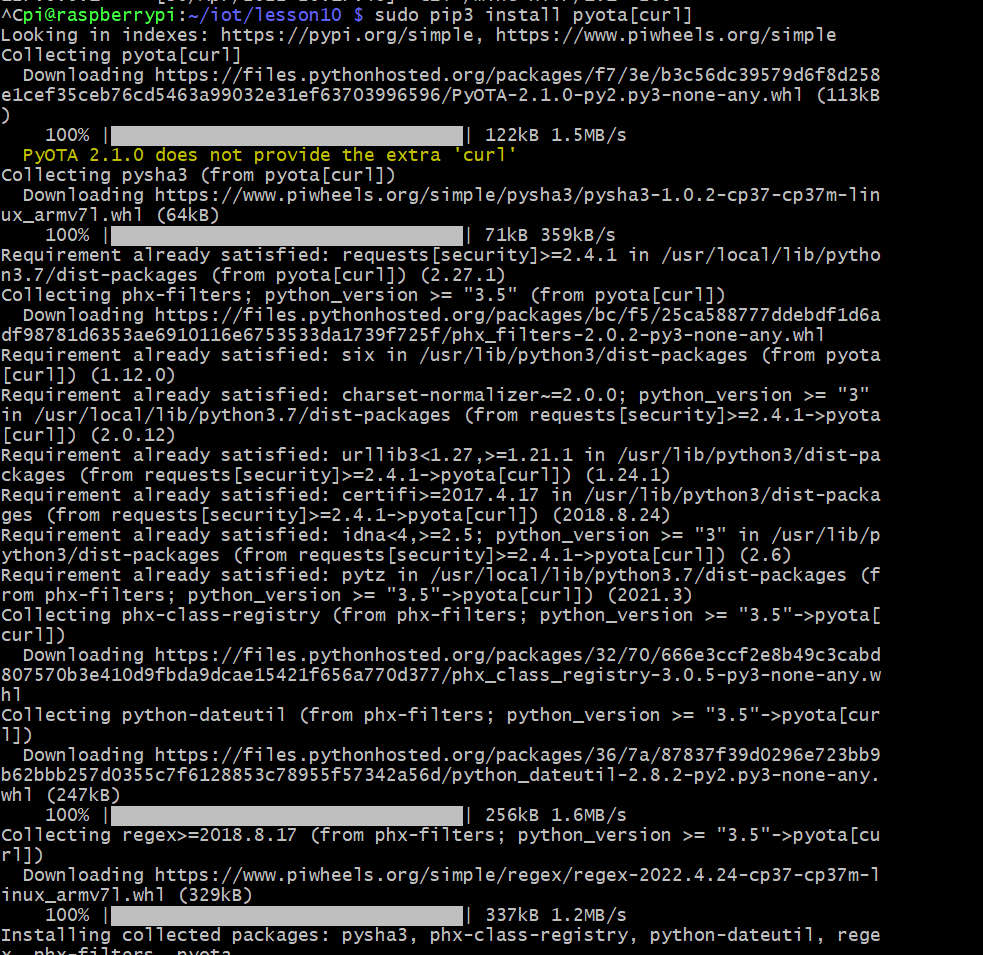
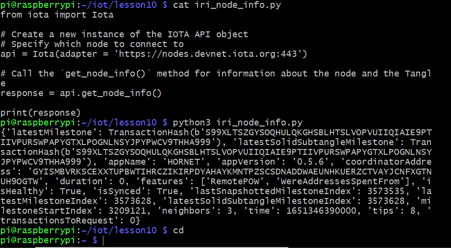

## Lab 10
## Snakecoin, Blockchain, and Pyota

This lab was performed using a headless Raspberry pi 4 Model B running Raspberry Pi OS. This lab used python3 to run code files found [here](https://github.com/kevinwlu/iot/tree/master/lesson10)

# cat hash_value.py

# Comparing Two python3 Hash Values

# cat snakecoin.py

# Running snakecoin.py

# cat snakecoin-server-full-code.py

# Snakecoin Using Terminal 1

# Snakecoin Using Terminal 2

# Install pyota[curl]

# Running iri_node_info.py

