# Lab 3
# Python

This lab was performed using a headless Raspberry pi 4 Model B running Raspberry Pi OS. This lab used python3 to run code files found [here](https://github.com/kevinwlu/iot/tree/master/lesson3)

## Basic Terminal Navigation Commands/Shortcuts
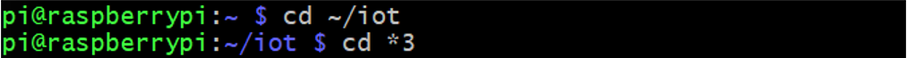

## julian.py
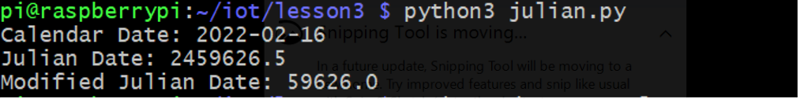

## date_example.py
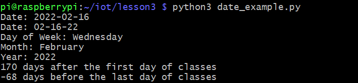

## datetime_example.py
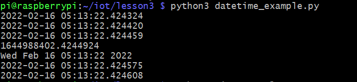

## time_example.py
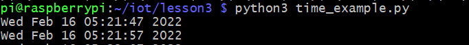

## sun.py 'New York'
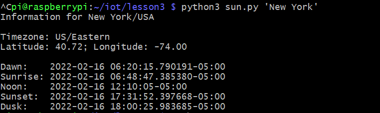

## moon.py
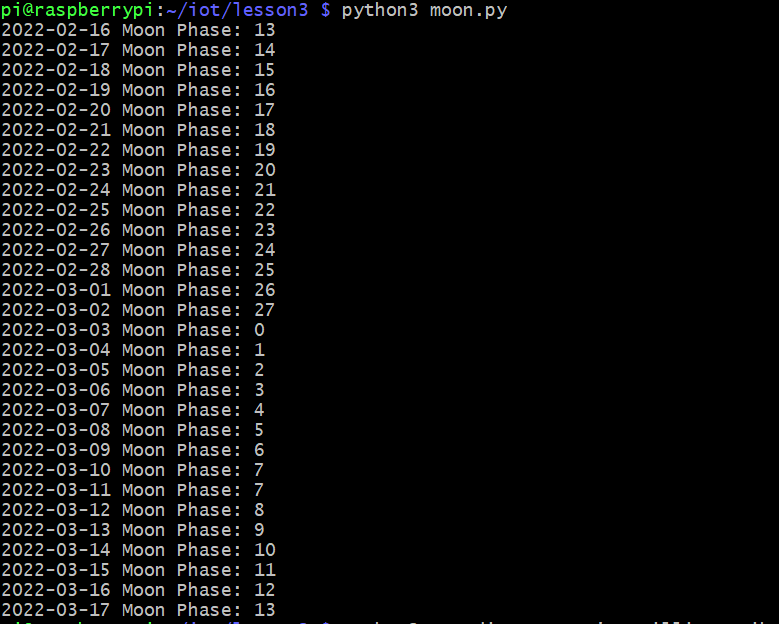

## coordinates.py 'SC Williams Library'
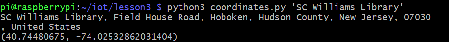

## address.py '40.74480675, -74.02532862031404'
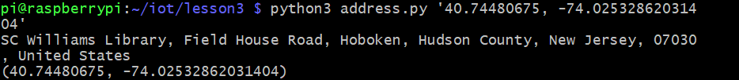

## cpu.py
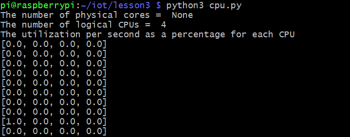

## battery.py
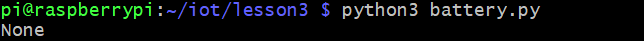

(RaspberryPi was powered directly through USB port)

## documentstats.py document.txt
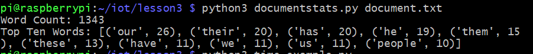
