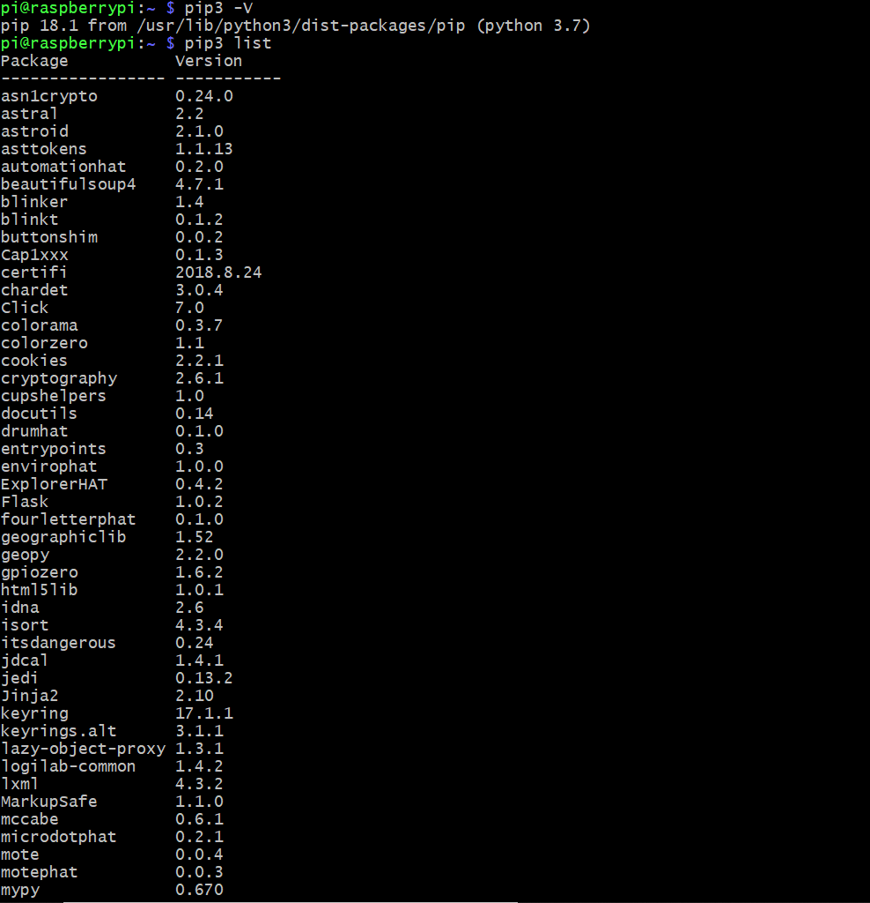
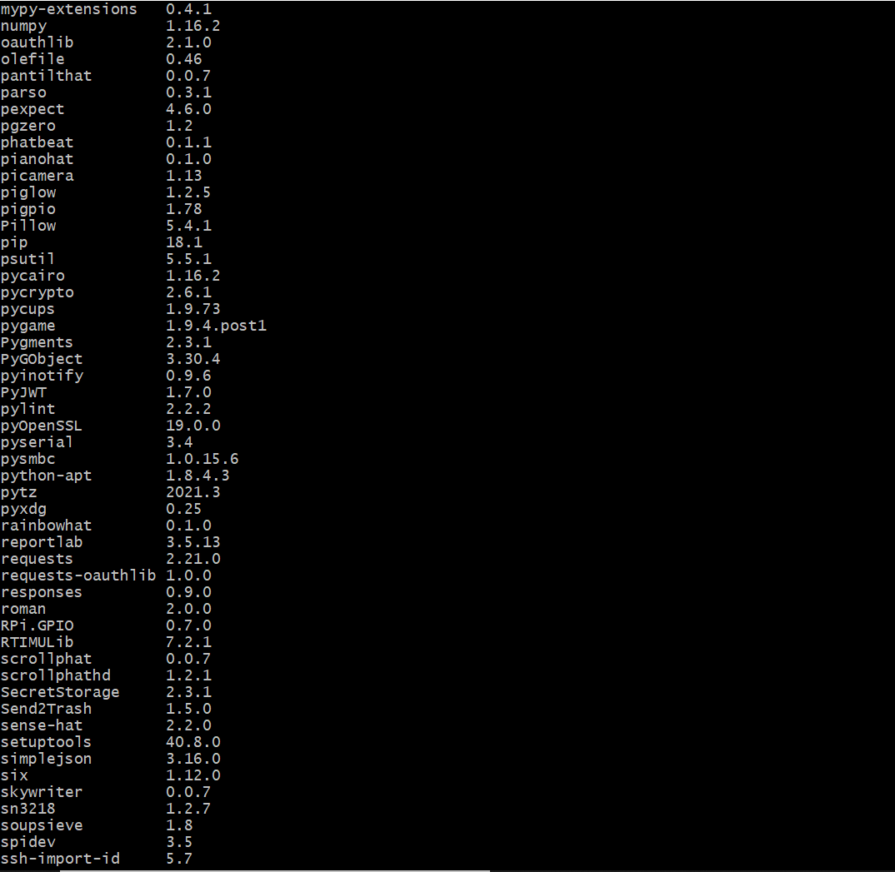
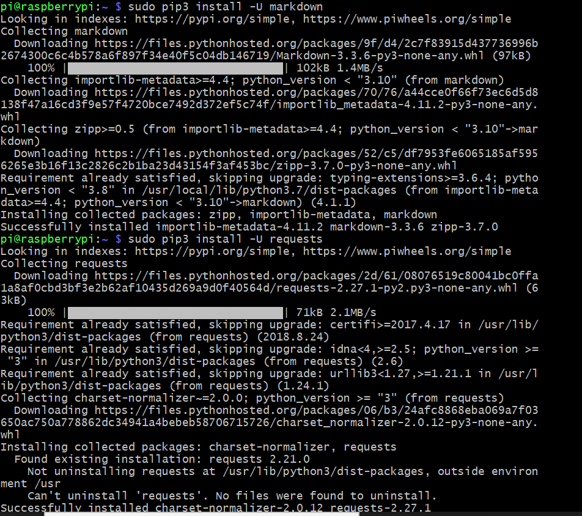
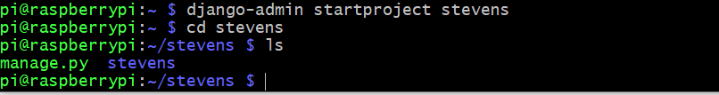
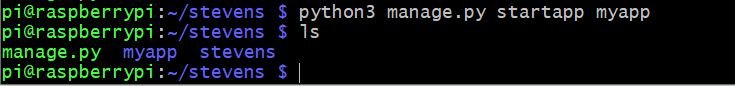
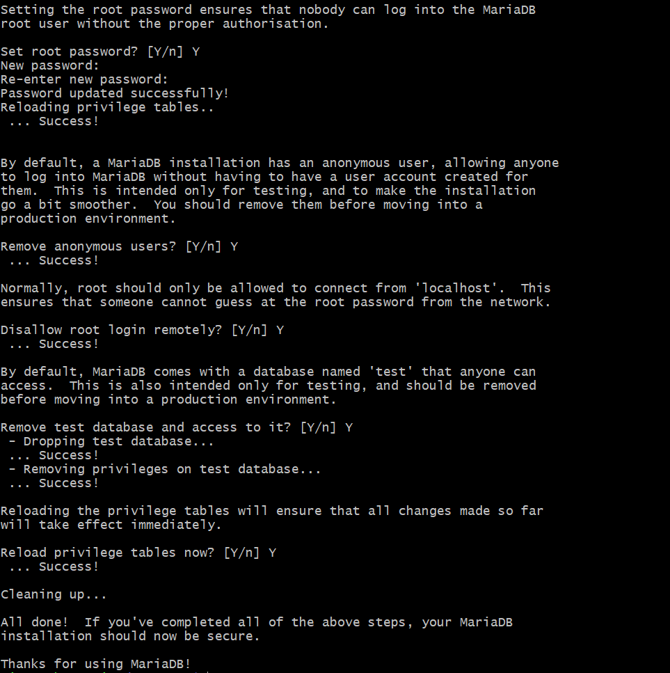
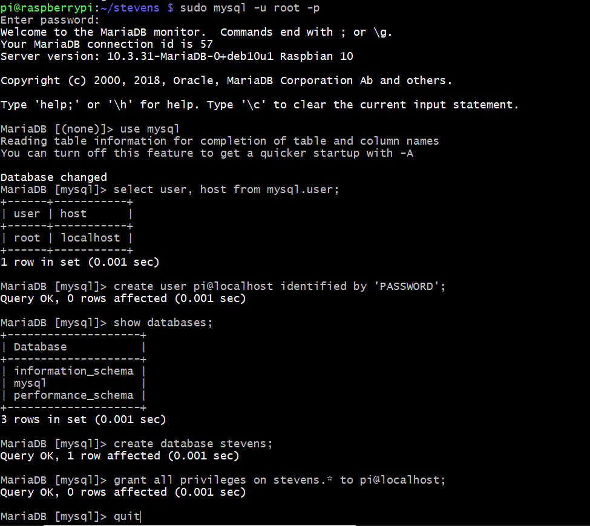
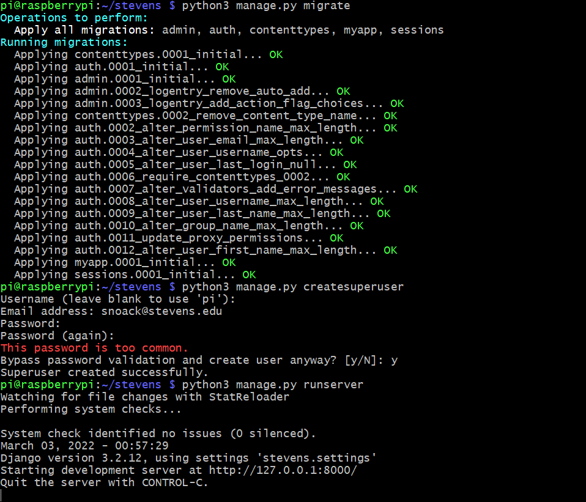

# Lab 4
# Django & Flask

This lab was performed using a headless Raspberry pi 4 Model B running Raspberry Pi OS. This lab used python3 to run code files [found here](https://github.com/kevinwlu/iot/tree/master/lesson4)

## pip3 list

## pip3 package installation process

## django-admin startproject stevens

## python3 manage.py startapp myapp

## Installing MariaDB

## Setting up MariaDB

## Migrating and setting up django server

At this point, trying to open the chromium browser simply resulted in site not reached errors. I tried to solve this issue but I believe viewing the server is not possible on a headless Pi through the lab4 instructions. 
