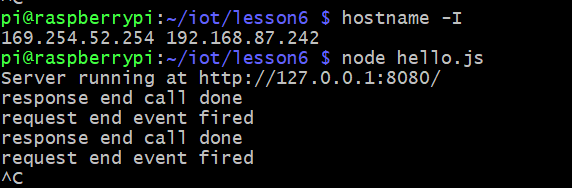

## Lab 6
## Node.js and Pystache

This lab was performed using a headless Raspberry pi 4 Model B running Raspberry Pi OS. This lab used python3 to run code files found [here](https://github.com/kevinwlu/iot/tree/master/lesson3)

# Installing Node.js

# Running hello.js server

# Server Running Online

# Installing and using Pystache

