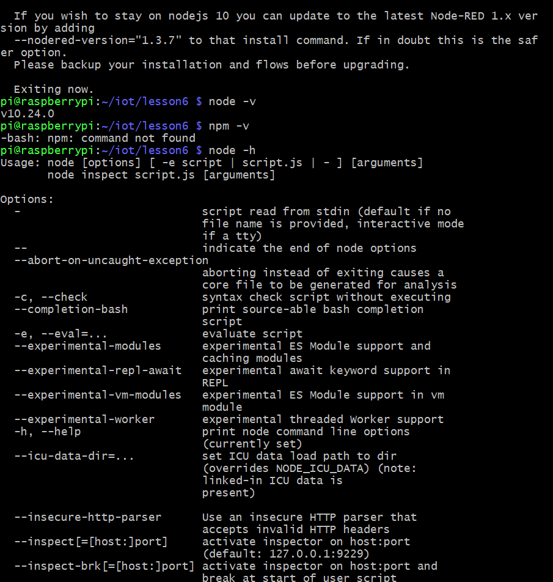
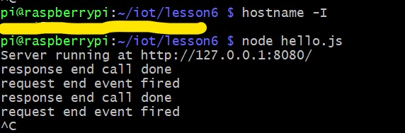
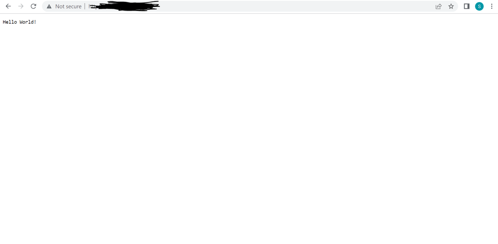
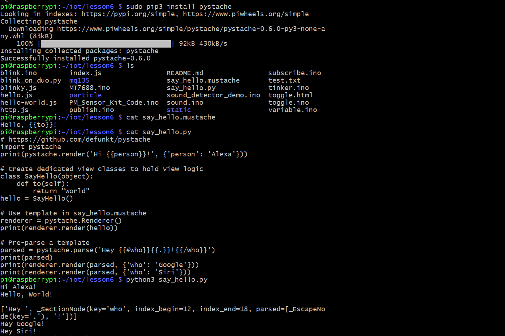

## Lab 6
## Node.js and Pystache

This lab was performed using a headless Raspberry pi 4 Model B running Raspberry Pi OS. This lab used python3 to run code files found [here](https://github.com/kevinwlu/iot/tree/master/lesson3)

# Basic node commands after Installing Node.js

# Finding Pi IP address & Running hello.js server

# Server Running Online

hello.js was the only server page that functioned. hello-world.js and http.js would run on the Pi, but visiting the webpage on my laptop would simply result in a page not found error. At first, I instinctively figured this might be due to a port issue, so I changed the default port of the final two programs to 8080. This did not work, so I tried using an alternative IP address for my Pi. This also failed. I ran out of ideas of how to go about loading the server on my headless Pi setup.

# Installing and using Pystache

