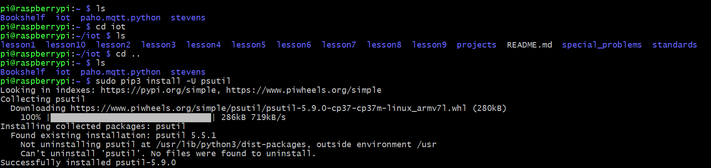
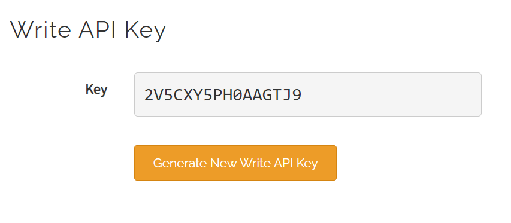

## Lab 7
## Thingspeak & Google Sheets

This lab was performed using a headless Raspberry pi 4 Model B running Raspberry Pi OS. This lab used python3 to run code files found [here](https://github.com/kevinwlu/iot/tree/master/lesson7)

# Setting up thingspeak code

# API key taken from thingspeak website

# Running thingspeak code with API key
