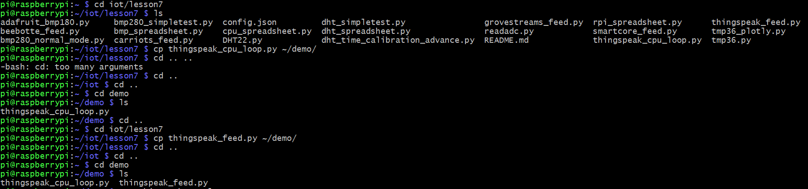
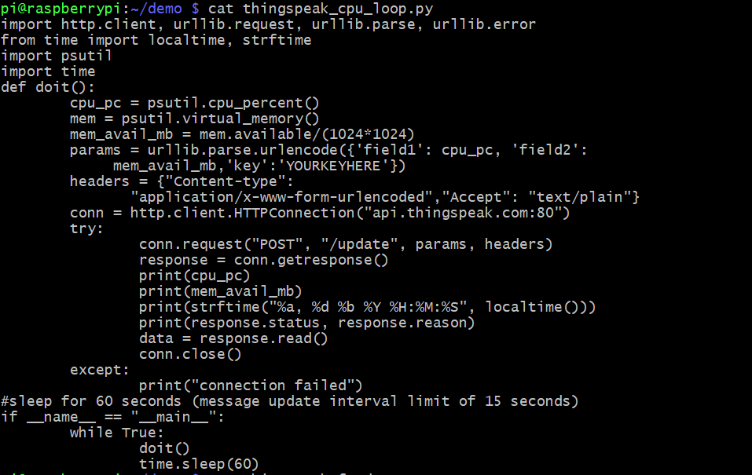
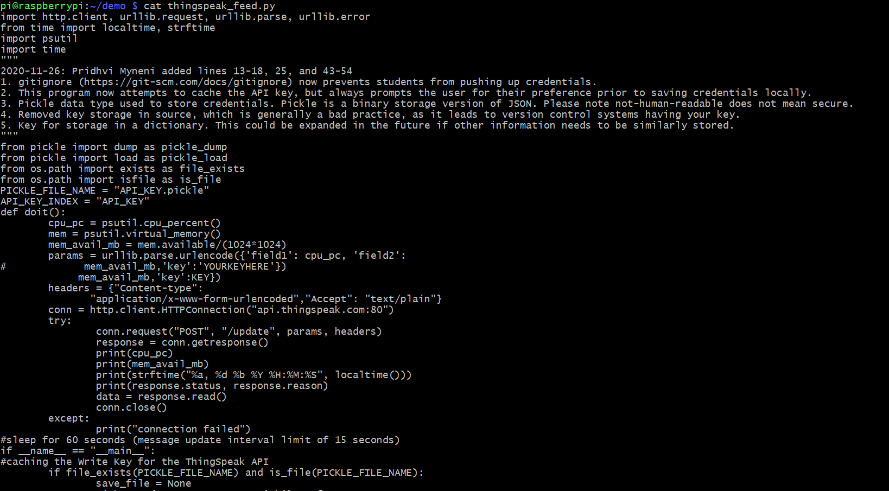
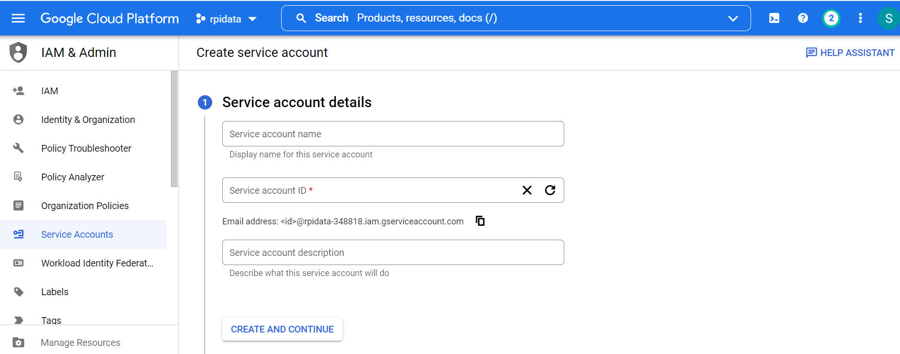

## Lab 7
## Thingspeak & Google Sheets

This lab was performed using a headless Raspberry pi 4 Model B running Raspberry Pi OS. This lab used python3 to run code files found [here](https://github.com/kevinwlu/iot/tree/master/lesson7)

# Setting up thingspeak code

# API key taken from thingspeak website

# Using cat text reader to view python code of thingspeak files

# Running thingspeak code with API key

For the second part of this lab, I was not able to get a working .json file. Instructions state to gain a .json key from the google creentials page, but there was no option for this that I could find, as shown below:

