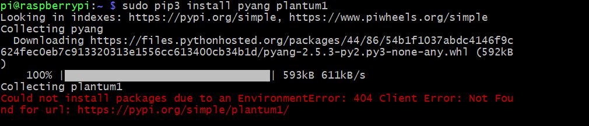
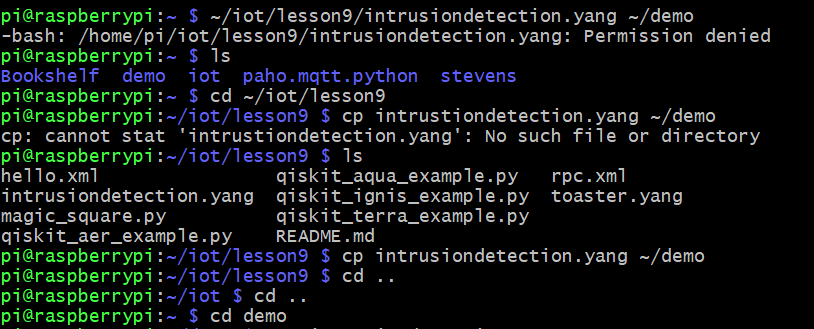
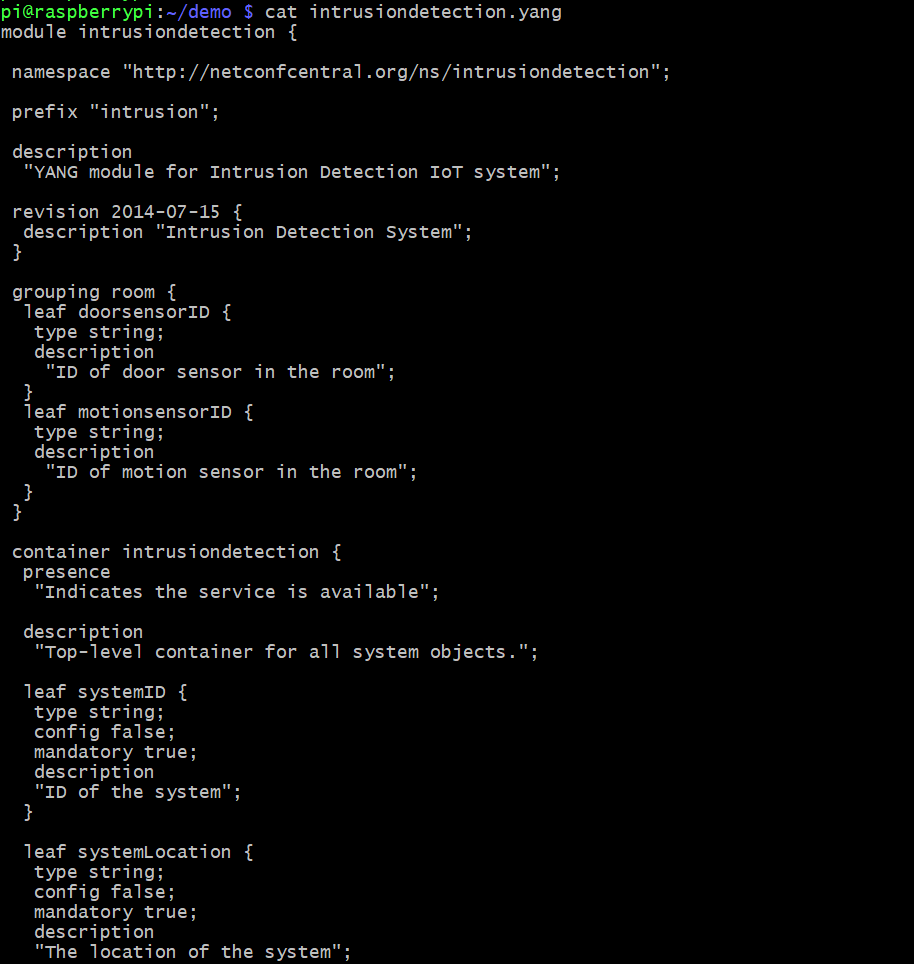
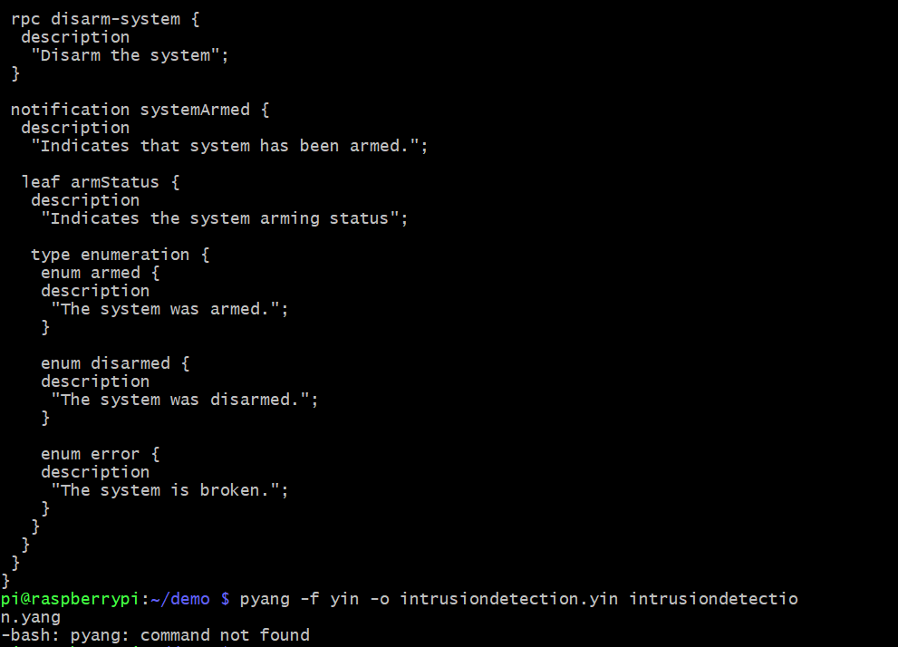

## Lab 9
## YANG

This lab was performed using a headless Raspberry pi 4 Model B running Raspberry Pi OS. This lab used python3 to run code files found [here](https://github.com/kevinwlu/iot/tree/master/lesson9)

# Installing Pyang

There was a 404 error attempting to install this. I am not sure if this program is no longer supported but I tried various install commands and I either got 404 errors or permission denied.

# Continuing with Setting up files

# Viewing intrusiondetection.yang with cat

# Attempting to run intrusiondetection.yang

